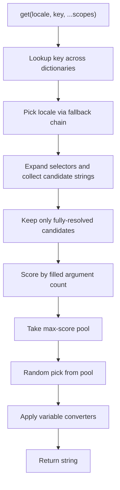

# Plan: `@webergency-utils/i18n`

Rebuild the legacy library in [`old/i18n.js`](old/i18n.js) as a zero-dependency, isomorphic TypeScript package (Node, React Native, React/Vue via plain JS API). Dual CJS/ESM via `tsup`, same shape as `@webergency-utils/limiter`.

## Locked decisions

| Topic | Choice |
|---|---|
| Variant arrays | Fully-resolved only → highest filled-arg count → random from that pool |
| Number declension | Locale value is a `#varname` selector object |
| Rule precedence | exact → modulo/affine (`2n+1`) → range (`2-Infinity`) → CLDR (`zero`/`one`/`two`/`few`/`many`) → `*` / `other` |
| Leaf / locale-map detection | **By value shape**, not by key regex alone |
| Locale codes | Real **BCP-47** (`sk`, `en-US`, `zh-Hans`, `sr-Latn`, three-letter `fil`, …) |
| Dictionary Storage | **Lazy On-Demand Caching (0ms load time, $O(1)$ memoized lookups)** |
| Platforms | Pure core, no Node `fs`/`require` path loading |
| Frameworks | No React/Vue packages in v1 — core is framework-agnostic |
| Style | radixxko Allman formatting |

## Dictionary shape

Supports both **multi-language** and **single-language** dictionary formats:

### 1. Multi-language format (per-leaf or per-root)

```ts
// Per-leaf multi-language
{
  greetings: {
    hello: {
      sk: [ 'Ahoj {name}', 'Čau {name}', 'Nazdar {name} {title}' ],
      en: 'Hello {name}',
      'zh-Hans': '你好 {name}',
      'sr-Latn': 'Zdravo {name}'
    }
  },
  to_men: {
    sk: {
      '#count': {
        '1': 'mužovi',
        '2n+1': 'mužíkom',
        '2-Infinity': 'mužom',
        '*': 'mužom'
      }
    },
    en: {
      '#count': {
        'one': 'man',
        'other': 'men'
      }
    }
  }
}

// Or per-root multi-language
{
  sk: { greetings: { hello: 'Ahoj {name}' } },
  en: { greetings: { hello: 'Hello {name}' } },
  'zh-Hans': { greetings: { hello: '你好 {name}' } }
}
```

### 2. Single-language format (no locale keys anywhere)

```ts
// Single-language dictionary bound to a locale (e.g. locale: 'sk')
{
  greetings: {
    hello: [ 'Ahoj {name}', 'Čau {name}', 'Nazdar {name} {title}' ]
  },
  to_men: {
    '#count': {
      '1': 'mužovi',
      '2n+1': 'mužíkom',
      '2-Infinity': 'mužom',
      '*': 'mužom'
    }
  }
}
```

Passed in constructor either as:
- `new I18N({ dictionaries: [ { locale: 'sk', dictionary: skDict }, { locale: 'en', dictionary: enDict } ] })`
- `new I18N({ dictionaries: [ { sk: skDict }, { en: enDict } ] })`

### Structural model (value-shape)

Three value kinds:

| Kind | Shape |
|---|---|
| **Translation leaf** | `string` \| `string[]` \| selector `{ '#var': { … } }` |
| **Locale map** | object whose **every child value** is a translation leaf; keys are BCP-47 locales |
| **Namespace** | object whose children are namespaces, locale maps, or (in single-lang trees) translation leaves |

**Locale map detection (replaces key-regex-only logic):**

A node is a **locale map** iff:

1. It is a plain object (not array, not selector)
2. It has at least one key
3. **Every child value** is a translation leaf (`string` | `string[]` | `{ '#…' }`)
4. **Every key** is a valid BCP-47 locale tag

Otherwise, if children are nested objects / mixed message keys → **namespace** (recurse). Mixing translation-leaf values with non-leaf values under the same node without forming a valid locale map → **mixed branch error**.

This fixes the `id` / `to` / `no` collision: message keys stay namespaces when their children are locale maps, not translation leaves.

```ts
// Namespace — children are locale maps, NOT translation leaves
messages: {
  id: { sk: 'Identifikátor', en: 'Identifier' },  // locale map
  to: { sk: 'Komu', en: 'To' }                    // locale map
}

// Locale map — children ARE translation leaves
hello: {
  sk: 'Ahoj',
  'zh-Hans': '你好',
  fil: 'Kumusta'   // three-letter OK
}
```

### BCP-47 locale tags

Replace `/^[a-z]{2}(-[A-Z]{2})?$/i` with a BCP-47 language-tag check that accepts:

- Primary language: 2-letter (`sk`, `en`) or 3-letter (`fil`, `ceb`)
- Script subtag: `zh-Hans`, `zh-Hant`, `sr-Latn`, `sr-Cyrl`
- Region subtag: `en-US`, `pt-BR`, `zh-Hans-CN`
- Common forms used as dictionary keys (case-insensitive match; store/lookup normalized)

Implementation: validate with a focused BCP-47 subset regex (language + optional script + optional region), not the old 2-letter-only pattern. Reject keys like `hello`, `messages`, `api` as locales.

Lookup remains exact on the requested locale string after the same normalization used when classifying maps (e.g. lower-case language, title-case script, upper-case region: `zh-hans` → `zh-Hans`).

### Other structural rules

1. **`#var` selectors:** `#count` reads scope variable `count`. Selector values may be translation leaves or nested selectors.
2. **Multiple dictionaries:** Last dictionary that defines a key for the target locale wins.
3. **Single-lang / per-root trees:** Inside a bound locale tree, translation leaves sit directly on message keys (no locale map). `dictionary()` must register those string/array/selector leaves when exporting.

## Resolution pipeline



### 1. Locale fallbacks

```ts
new I18N({ dictionaries: [dict], locale: 'en', fallbacks: ['sk', 'en'] })
```

Resolve `requested → …fallbacks → options.locale`. First locale that defines the leaf wins. Missing key → return the key string (old behavior).

If a leaf exists but **no fully-resolved** candidate remains, treat as unresolved for that locale and continue the fallback chain (do not emit bare placeholder paths as a successful hit).

### 2. `#var` selectors

Match `scopes` value for `var` against rule keys:

- **Exact:** `"1"`, `"0"`, `"-3"`
- **Affine:** `"2n+1"`, `"2N"`, `"10n+5"` → `value = a*k + b` for integer `k >= 0`
- **Range:** `"2-Infinity"`, `"2-4"`, `"-Infinity-0"` (inclusive)
- **CLDR Plural Categories:** `"zero"`, `"one"`, `"two"`, `"few"`, `"many"` via `Intl.PluralRules(locale).select(value)`
- **Catch-all:** `"*"` (or `"other"`)

Precedence: exact > affine > range (narrower span wins) > CLDR (`zero`/`one`/`two`/`few`/`many`) > `*`/`other`. Nested selectors expand depth-first.

Affine matching must use `k = (value - b) / a` with integer `k >= 0` (correct for negative `a`).

### 3. Array / specificity + random

1. Resolve every `{path}` / `{path%converter}` against scopes
2. Discard if any variable is missing
3. Score = number of distinct variables successfully filled
4. Keep the max-score pool; `random()` picks one (injectable for tests)
5. If the pool is empty → unresolved (locale/key fallback continues)

### 4. Custom converters

```ts
new I18N({
  dictionaries: [dict],
  converters: {
    upper: (v) => String(v).toUpperCase(),
    currency: (v, args) => Number(v).toFixed(Number(args ?? 2))
  }
})
```

Template syntax: `{price%currency:2}`, `{name%upper}`. Unknown converter → stringify value. Optional `transform?: (s: string) => string` for whole-string post-process.

## Public API

```ts
class I18N {
  constructor(options: {
    dictionaries: Dictionary | Dictionary[]
    locale?: string                    // default / last-resort fallback
    fallbacks?: string[]               // ordered fallback chain
    converters?: Record<string, Converter>
    transform?: (value: string) => string
    random?: () => number              // default Math.random
  })

  get(locale: string, ...args: Array<string | object>): string
  // get('zh-Hans', 'greetings.hello', { name: 'Tom' })
  // get('sk', 'to_men', { count: 3 })

  dictionary(locale: string, path?: string): object
  // export one language tree; preserves arrays + #selectors
  // registers string leaves in single-lang / per-root trees
  // fills missing leaves from fallback chain
}
```

No filesystem loaders in core — pass imported/parsed JSON objects (mobile-safe).

## Package layout

```
i18n/
  old/i18n.js
  src/
    index.ts
    i18n.ts
    resolve.ts
    select.ts
    rules.ts
    path.ts
    locale.ts          # BCP-47 validate + normalize
    structure.ts       # isTranslationLeaf / isLocaleMap / isSelector
    validate.ts
    types.ts
    tests/
      i18n.test.ts
      select.test.ts
      rules.test.ts
      export.test.ts
      locale.test.ts
      structure.test.ts
      validate.test.ts
  package.json
  tsup.config.ts
  tsconfig.json
  vitest.config.ts
```

## Fix-up work (current codebase)

Already implemented; adjust to match this plan:

1. **Locale detection** — stop using 2-letter-only `LOCALE_REGEX` as the sole branch classifier; use translation-leaf value shape + BCP-47 keys (`locale.ts` / `structure.ts`)
2. **`dictionary()` export** — register plain string leaves under single-lang and per-root trees; walk namespaces whose children are locale maps (so `messages.id` / `messages.to` export correctly)
3. **Selection** — remove partial-template success path; empty fully-resolved pool → fall through locale/key chain
4. **Affine** — integer `k >= 0` formula (negative `a` safe)
5. **Tests** — `zh-Hans` / `sr-Latn` / `fil`; two-letter message keys (`id`, `to`); single-lang + per-root export; partial vars → fallback locale

## Implementation order

1. Scaffold package (`package.json`, `tsup`, `tsconfig`, vitest) mirroring limiter — **done**
2. Port path lookup + multi-dictionary + locale fallback chain — **done**
3. Fully-resolved / max-score / random selection — **done** (tighten: no partial success)
4. `#var` rule engine + nesting — **done** (fix negative affine)
5. Converters — **done**
6. Value-shape locale maps + BCP-47 — **todo**
7. `dictionary(locale)` export for all formats — **todo** (fix string-leaf omission)
8. Vitest coverage for the cases above — **todo**
9. README refresh after API is stable

## Out of scope (v1)

- React/Vue bindings (document wrapping `get` in a hook/composable)
- Full ICU MessageFormat AST (CLDR categories live inside `#var` rules only)
- Node file-path auto-require from the old constructor
- CI/Scorecard follow-up via webergency-ci after the library ships
